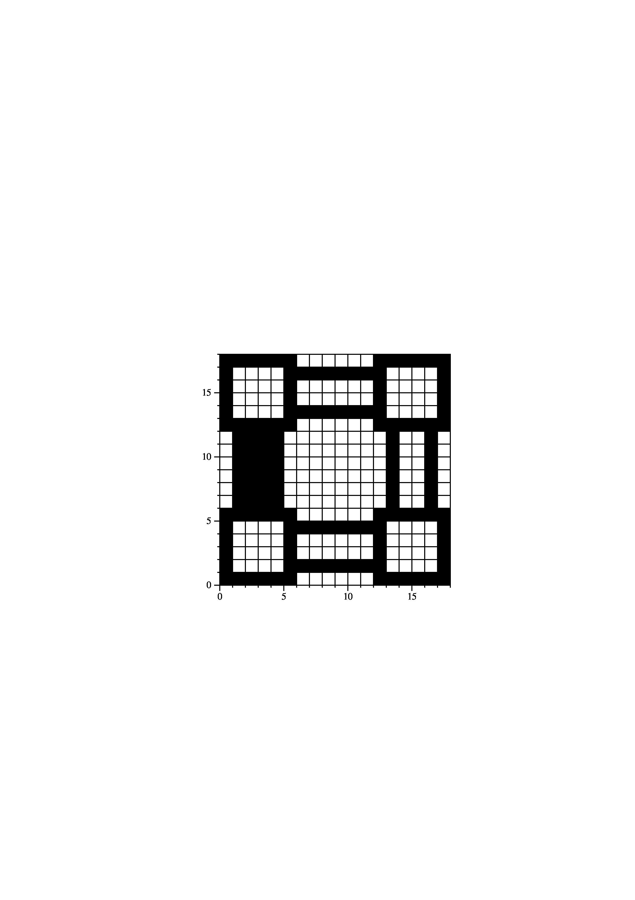
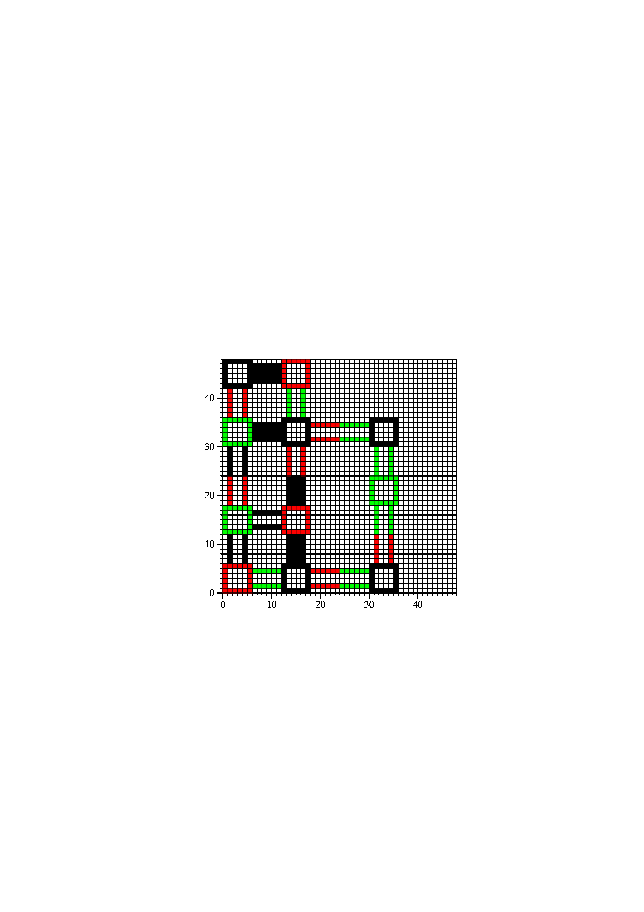

# Minecraft_Castles
- Jonathan Graham
- Last revision: Sept. 28th, 2020
- Created for a lab in Jim Plank's COSC 494 course at UTK, [Lab1:Jgraph](http://web.eecs.utk.edu/~jplank/plank/classes/cs494/494/labs/Lab-1-Jgraph/)

## Description

This is a program to generate square grids of Minecraft castle blueprints. It reads in from a .txt file populated with numbers 0 - 5.
The numbers are as follows :

    0 - Empty square of dimentions edge X edge
    1 - Tower: This will place a square tower of the given edge length.
    2 - Vertical Wall: This will place a wall that blocks horizontal movement.
    3 - Horizontal Wall: This will place a wall that blocks vertical movement.
    4 - Vertical Gate: This places a solid vertical wall signifying a gate in the wall.
    5 - Horizontal Gate: This places a solid horizontal wall signifying a gate in the wall.

## Running Instruction

To run the examples given simply enter :
    sh RunGenerator.sh

The shell script RunGenerator.sh does everything you need to do to generate the needed 5 output jpgs.

If you want to run your own .txt files you need to create the file as a matrix of the allowed inputs. If anything in the matrix is greater than 5 there will be an error and the program will exit.

Feel free to look at the example inputs in the files directory for how to format them. The program does allow for non square .txt matrices (as shown in the examples below).
If you use your own inputs you will need to run :
    make
    ./bin/jgraphGenerator <input file> <edge length> <number of colors> | ./jgraph -P | ps2pdf - | convert -density 300 - -quality 100 <output file>

## Examples
The program does not generate the input files, but they are very simple to create. The input files are stored in the files directory as castle#.txt.
For instance, files/castle1.txt is :

    131
    402
    131
   
Which (when using an edge length of 6 and 1 color) produces :

When running the script with 6 and 3 you get this from files/castle3.txt input :

